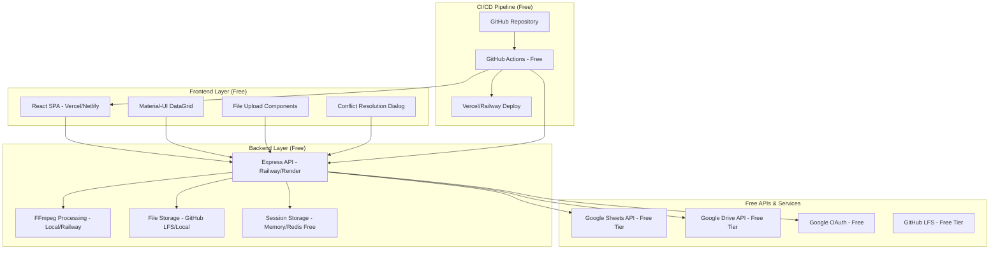

# Design Document

## Overview

MOTK is a web-based production management system built on a completely free architecture combining Google Sheets as a backend data store with free file storage solutions. The system features a React-based frontend with Material-UI components, a Node.js/Express API layer deployed on free platforms, and specialized file handling workflows for production media assets.

The architecture prioritizes real-time collaboration, conflict resolution, and cost-free deployment while maintaining professional-grade functionality through clever use of free services and local storage solutions.

## Architecture

### System Architecture Diagram



### Technology Stack

**Frontend (Free):**
- React 18+ with TypeScript
- Material-UI v5 for component library
- MUI DataGrid for table views
- React Query for data fetching and caching
- React Router for navigation
- Axios for HTTP client
- Deployed on Vercel or Netlify (free tier)

**Backend (Free):**
- Node.js with Express.js
- Google APIs Node.js client library
- Multer for file upload handling
- FFmpeg for video processing (local or Railway)
- JWT for stateless authentication
- Deployed on Railway, Render, or Heroku (free tier)

**Storage & Data (Free):**
- Google Sheets API v4 for data persistence (free tier: 100 requests/100 seconds/user)
- Google Drive API v3 for file storage (15GB free per account)
- GitHub LFS for large file storage (1GB free per repo)
- Local file system for temporary processing
- In-memory session storage or free Redis (Upstash)

**Deployment & CI/CD (Free):**
- GitHub repository for source control
- GitHub Actions for CI/CD pipeline (2000 minutes/month free)
- Vercel/Netlify for frontend deployment
- Railway/Render for backend deployment

## Components and Interfaces

### Core Components

#### 1. SheetsDataManager
```typescript
interface SheetsDataManager {
  initializeProject(projectConfig: ProjectConfig): Promise<ProjectMeta>
  getSheetData(sheetName: string, range?: string): Promise<SheetData>
  updateCell(params: CellUpdateParams): Promise<UpdateResult>
  batchUpdate(updates: BatchUpdateParams[]): Promise<BatchResult>
}

interface CellUpdateParams {
  sheetName: string
  entityId: string
  fieldId: string
  originalValue: any
  newValue: any
  force?: boolean
}
```

#### 2. StorageManager
```typescript
interface StorageManager {
  createEntityFolder(entityType: string, entityId: string): Promise<FolderInfo>
  uploadFile(entityId: string, file: File, fieldName?: string): Promise<FileInfo>
  generateProxy(originalFile: FileInfo): Promise<ProxyInfo>
  moveToDeleted(entityType: string, entityId: string): Promise<void>
  getFileUrl(path: string, isProxy: boolean): string
}

interface FileInfo {
  id: string
  name: string
  size: number
  mimeType: string
  path: string
  url: string
}
```

#### 3. ConflictResolver
```typescript
interface ConflictResolver {
  detectConflict(original: any, current: any): boolean
  presentResolutionDialog(conflict: ConflictData): Promise<ResolutionChoice>
  applyResolution(choice: ResolutionChoice, params: CellUpdateParams): Promise<void>
}

enum ResolutionChoice {
  OVERWRITE = 'overwrite',
  EDIT_AGAIN = 'edit_again',
  KEEP_SERVER = 'keep_server'
}
```

#### 4. EntityManager
```typescript
interface EntityManager {
  createEntity(type: EntityType, data: EntityData): Promise<Entity>
  updateEntity(id: string, updates: Partial<EntityData>): Promise<Entity>
  deleteEntity(id: string): Promise<void>
  linkEntities(sourceId: string, targetId: string, linkType: LinkType): Promise<void>
}

type EntityType = 'shot' | 'asset' | 'task' | 'member' | 'user'
```

### API Endpoints

#### Authentication
- `POST /auth/login` - Google OAuth authentication
- `POST /auth/refresh` - Refresh JWT token
- `POST /auth/logout` - Invalidate session

#### Data Operations
- `GET /api/sheets/:sheetName` - Fetch sheet data
- `PUT /api/sheets/:sheetName/cell` - Update single cell
- `POST /api/sheets/:sheetName/batch` - Batch update cells
- `POST /api/projects/init` - Initialize new project

#### File Operations
- `POST /api/files/upload/:entityId` - Upload file to entity folder
- `GET /api/files/:entityId/:fileName` - Get file URL
- `POST /api/files/proxy/:fileId` - Generate proxy file
- `DELETE /api/files/:entityId/:fileName` - Delete file

#### Entity Management
- `GET /api/entities/:type` - List entities of type
- `POST /api/entities/:type` - Create new entity
- `PUT /api/entities/:type/:id` - Update entity
- `DELETE /api/entities/:type/:id` - Delete entity

## Data Models

### Core Entity Models

#### Shot Model
```typescript
interface Shot {
  shot_id: string
  episode?: string
  scene?: string
  title: string
  status: ShotStatus
  priority?: number
  due_date?: Date
  timecode_fps?: string
  folder_label?: string
  folder_url?: string
  thumbnails?: FileReference[]
  file_list?: FileReference[]
  versions?: VersionReference
  notes?: string
}
```

#### Asset Model
```typescript
interface Asset {
  asset_id: string
  name: string
  asset_type: AssetType
  status?: AssetStatus
  overlap_sensitive?: boolean
  folder_label?: string
  folder_url?: string
  thumbnails?: FileReference[]
  file_list?: FileReference[]
  versions?: VersionReference
  notes?: string
}
```

#### Task Model
```typescript
interface Task {
  task_id: string
  name: string
  status: TaskStatus
  assignee_id?: string
  start_date?: Date
  end_date?: Date
  shot_id?: string
  folder_label?: string
  folder_url?: string
  notes?: string
}
```

### Configuration Models

#### Project Configuration
```typescript
interface ProjectConfig {
  project_id: string
  storage_provider: 'gdrive' | 'box'
  originals_root_url: string
  proxies_root_url: string
  created_at: Date
}
```

#### Field Definition
```typescript
interface FieldDefinition {
  field_id: string
  entity: EntityType
  field_name: string
  type: FieldType
  editable: boolean
  required: boolean
  options?: string[]
}

type FieldType = 'text' | 'select' | 'number' | 'date' | 'checkbox' | 
                 'url' | 'thumbnails' | 'file_list' | 'versions' |
                 'link_shot' | 'link_asset' | 'link_task' | 'link_member' | 'link_user'
```

## Error Handling

### Error Classification

#### Client-Side Errors
- **Validation Errors**: Field type mismatches, required field violations
- **Network Errors**: Connection timeouts, offline scenarios
- **Conflict Errors**: Concurrent edit conflicts requiring user resolution

#### Server-Side Errors
- **Authentication Errors**: Expired tokens, insufficient permissions
- **API Quota Errors**: Google Sheets/Drive API rate limiting
- **Storage Errors**: File upload failures, storage quota exceeded

### Error Handling Strategy

```typescript
interface ErrorHandler {
  handleValidationError(error: ValidationError): void
  handleNetworkError(error: NetworkError): Promise<void>
  handleConflictError(error: ConflictError): Promise<ResolutionChoice>
  handleAuthError(error: AuthError): void
  handleStorageError(error: StorageError): void
}
```

#### Retry Logic
- Network errors: Exponential backoff up to 3 attempts
- API quota errors: Exponential backoff with jitter
- File upload errors: Chunked upload with resume capability

#### User Feedback
- Toast notifications for non-blocking errors
- Modal dialogs for conflicts requiring user input
- Progress indicators for long-running operations
- Detailed error logs for debugging

## Testing Strategy

### Unit Testing
- **Component Testing**: React components with React Testing Library
- **Service Testing**: API endpoints with Jest and Supertest
- **Utility Testing**: Data transformation and validation functions
- **Mock Strategy**: Google APIs mocked with jest.mock()

### Integration Testing
- **API Integration**: End-to-end API workflows with test Google Sheets
- **File Upload**: Complete file upload and proxy generation workflows
- **Authentication**: OAuth flow with test Google accounts
- **Conflict Resolution**: Concurrent edit scenarios

### Performance Testing
- **Load Testing**: Multiple concurrent users editing sheets
- **File Upload**: Large file upload performance and timeout handling
- **Proxy Generation**: Video processing performance benchmarks
- **Memory Usage**: Long-running session memory leak detection

### Test Data Management
```typescript
interface TestDataManager {
  createTestProject(): Promise<ProjectConfig>
  seedTestData(projectId: string): Promise<void>
  cleanupTestData(projectId: string): Promise<void>
  createMockFiles(): FileInfo[]
}
```

### Testing Environment
- **Development**: Local Google Sheets with test data
- **Staging**: Dedicated test Google account with isolated sheets
- **CI/CD**: Automated test suite with mocked external dependencies
- **Performance**: Load testing environment with realistic data volumes

## Free Deployment Architecture

### GitHub Integration
- **Source Control**: All code stored in GitHub repository
- **Branch Strategy**: Main branch for production, develop branch for staging
- **Pull Request Workflow**: Code review and automated testing before merge
- **Release Management**: Tagged releases for version control

### Express.js API Structure
```typescript
// Express routes for API endpoints
app.post('/auth/login', authController.login);
app.get('/api/sheets/:sheetName', sheetsController.getSheetData);
app.put('/api/sheets/:sheetName/cell', sheetsController.updateCell);
app.post('/api/files/upload/:entityId', filesController.uploadFile);
app.post('/api/entities/:type', entitiesController.createEntity);
```

### CI/CD Pipeline with GitHub Actions
```yaml
# .github/workflows/deploy.yml
name: Deploy to Free Platforms
on:
  push:
    branches: [main]
  pull_request:
    branches: [main]

jobs:
  test:
    runs-on: ubuntu-latest
    steps:
      - uses: actions/checkout@v3
      - name: Setup Node.js
        uses: actions/setup-node@v3
      - name: Install dependencies
        run: npm ci
      - name: Run tests
        run: npm test
      - name: Build project
        run: npm run build

  deploy-frontend:
    needs: test
    runs-on: ubuntu-latest
    if: github.ref == 'refs/heads/main'
    steps:
      - uses: actions/checkout@v3
      - name: Deploy to Vercel
        uses: amondnet/vercel-action@v20
        with:
          vercel-token: ${{ secrets.VERCEL_TOKEN }}
          vercel-project-id: ${{ secrets.VERCEL_PROJECT_ID }}

  deploy-backend:
    needs: test
    runs-on: ubuntu-latest
    if: github.ref == 'refs/heads/main'
    steps:
      - uses: actions/checkout@v3
      - name: Deploy to Railway
        uses: bervProject/railway-deploy@v1.2.0
        with:
          railway_token: ${{ secrets.RAILWAY_TOKEN }}
          service: motk-api
```

### Environment Configuration
- **Development**: Local .env files for development
- **Staging**: Platform environment variables (Vercel/Railway)
- **Production**: Platform environment variables with secure secrets
- **Configuration**: Environment-specific settings managed through platform dashboards

### Scaling and Performance
- **Auto-scaling**: Railway/Render automatically scale based on request volume
- **Cold Start Optimization**: Keep services warm with health check endpoints
- **Resource Allocation**: Free tier limits managed through efficient code
- **Caching Strategy**: In-memory caching and browser localStorage for sessions

### Security Considerations
- **API Keys**: Google API keys with domain restrictions
- **JWT Security**: Secure token generation and validation
- **CORS Configuration**: Proper cross-origin resource sharing setup
- **Rate Limiting**: Client-side and server-side request throttling
- **Data Validation**: Input sanitization and validation on all endpoints